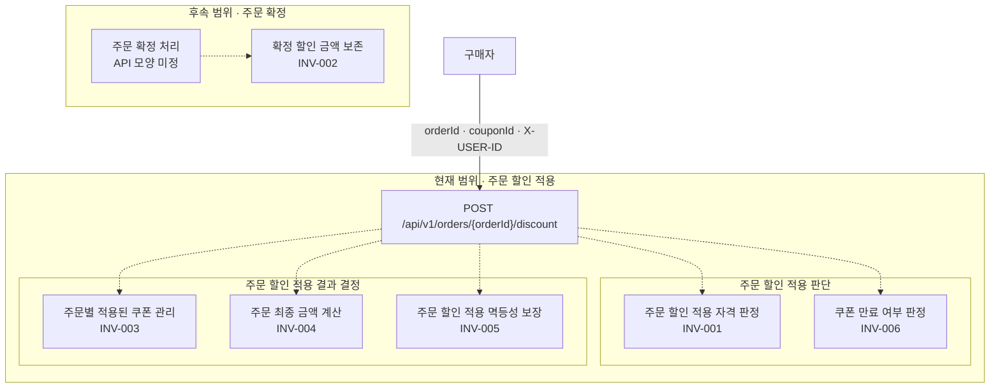

# 주문 할인 적용 유스케이스 계약

## 기준 문장과 출처

> “구매자는 주문 확정 전에 보유 쿠폰을 적용할 수 있고, 확정된 할인 금액은 나중에 바뀌지 않아야 합니다.”

- 출처: Week 1 Guide의 기준 문장

## 0. 기존 HTTP 동작 관찰

처음 접한 시스템에서는 문서에 적힌 요구사항만으로 현재 동작을 단정하지 않는다. 외부 인터페이스에 대표 입력을 보내고 관찰 결과를 테스트로 재현하여, 요구사항과 실제 동작이 일치하는지 검증할 수 있는 방법을 먼저 확보한다.

주문 할인 기능 구현 전에는 기존 Example API를 관찰해 이후 계약 검증 방식을 확인한다. 이 결과는 쿠폰 정책의 근거로 사용하지 않는다.

| 입력 분류 | 실제 HTTP 입력                                  | HTTP status       | `meta.result` | `meta.errorCode` | `meta.message`                                         | `data`                                                    |
| ----- | ------------------------------------------- | -----------------: | ------------- | ---------------- | ------------------------------------------------------ | --------------------------------------------------------- |
| 정상 숫자 | 저장된 Example ID로 `GET /api/v1/examples/{id}` | `200 OK`          | `SUCCESS`     | 없음(키 생략)         | 없음(키 생략)                                               | `{"id": 저장된 ID, "name": "예시 제목", "description": "예시 설명"}` |
| 문법 오류 | `GET /api/v1/examples/abc`                  | `400 BAD_REQUEST` | `FAIL`        | `Bad Request`    | `요청 파라미터 'exampleId' (타입: Long)의 값 'abc'이(가) 잘못되었습니다.` | 없음(키 생략)                                                  |
| 미존재   | `GET /api/v1/examples/-1`                   | `404 NOT_FOUND`   | `FAIL`        | `Not Found`      | `[id = -1] 예시를 찾을 수 없습니다.`                             | 없음(키 생략)                                                  |
| 미매핑   | `GET /api/v1/unmapped`                      | `404 NOT_FOUND`   | `FAIL`        | `Not Found`      | `존재하지 않는 요청입니다.`                                       | 없음(키 생략)                                                  |

## 요구 분류

### 확인된 제품 약속

| ID         | 확인된 사실                                    |
| ---------- | ----------------------------------------- |
| `FACT-001` | 구매자는 주문 확정 전에 보유 쿠폰으로 주문 할인 적용을 수행할 수 있다. |
| `FACT-002` | 주문 확정 시 결정된 할인 금액은 이후 변경되지 않는다.           |

### 실습  조건

- 아래 조건은 제품 담당자와 논의하고 확정한 조건으로 가정한다. `COND-002`의 최종 금액이 0원보다 작을 수 없다는 금액 경계도 제품 담당자에게 확인된 조건이다.

| ID         | 조건                                                                         |
| ---------- | -------------------------------------------------------------------------- |
| `COND-001` | 한 주문에는 적용된 쿠폰이 한 장만 존재한다.                                                  |
| `COND-002` | 최종 금액은 `finalAmount = originalAmount - discountAmount`로 계산하며 0원보다 작을 수 없다. |
| `COND-003` | 주문 확정 전 동일한 요청은 처음 결정된 주문 할인 적용 결과를 재사용한다.                                  |
| `COND-004` | 쿠폰 만료 여부는 시스템 접수 시각을 기준으로 판단한다.                                            |

이 문서에서 동일한 요청은 동일한 구매자·주문 ID·쿠폰 ID로 구성된 주문 할인 적용 요청을 뜻한다. 다만 다른 쿠폰이 적용된 뒤 과거에 적용했던 쿠폰을 다시 요청하는 경우는 동일 요청의 재사용으로 보지 않고 `Q-03`의 쿠폰 교체 정책을 따른다.

### 제품 담당자 확인 필요한 질문

**현재 제품 요구사항으로부터 파생되는가**, **주문 할인 적용의 성공·실패 또는 반환 금액에 직접 영향을 주는가**를 기준으로 질문을 선별한다.

이유 : 현재 요구사항과 직접 맞닿지 않은 질문은 확인된 근거 없이 제품 정책을 주관적으로 파생시키고 계약의 불필요한 복잡도를 높일 수 있다고 판단하여 제외한다.

| ID     | 파생 요구사항                                      | 질문                                                                                                                                            | 답에 따라 달라지는 항목                                                                                          |
| ------ | -------------------------------------------- | --------------------------------------------------------------------------------------------------------------------------------------------- | ------------------------------------------------------------------------------------------------------ |
| `Q-01` | `FACT-001` · 보유 쿠폰                           | ‘보유 쿠폰’은 구매자 본인에게 발급·귀속된 쿠폰만 의미하는가, 다른 구매자에게 공유받은 쿠폰도 포함하는가?                                                                                  | **사용자 응답:** 공유받은 쿠폰의 주문 할인 적용 성공 또는 권한 부족 오류 중 반환할 결과가 달라진다. **권한:** 보유 쿠폰으로 인정할 구매자와 쿠폰의 관계가 달라진다. |
| `Q-02` | `COND-002` · 최종 금액은 0원 이상                    | 할인 금액이 원금을 초과하면 할인 금액을 원금으로 제한할 것인가, 주문 할인 적용을 거절할 것인가?                                                                                       | **사용자 응답:** 0원으로 제한된 주문 할인 적용 결과 또는 주문 할인 적용 불가 오류가 반환된다.                                              |
| `Q-03` | `COND-001` · 한 주문에 적용된 쿠폰 한 장                | 주문 확정 전, 이미 쿠폰이 적용된 주문에 다른 쿠폰으로 주문 할인 적용을 요청하면 어떤 흐름으로 처리할 것인가? 예: 기존 쿠폰을 해제하고 새 쿠폰으로 교체하거나, 요청을 거절하고 구매자가 기존 쿠폰을 명시적으로 해제한 뒤 다시 요청하도록 한다. | **사용자 응답:** 적용된 쿠폰이 새 쿠폰으로 변경된 주문 할인 적용 결과 또는 기존 쿠폰의 해제가 필요하다는 오류 중 반환할 결과가 달라진다.                      |
| `Q-04` | `COND-004` · 시스템 접수 시각 기준 만료 판단              | 시스템 접수 시각과 쿠폰 만료 시각이 같으면 쿠폰을 유효한 것으로 판단할 것인가, 만료된 것으로 판단할 것인가?                                                                                | **사용자 응답:** 주문 할인 적용 성공 또는 쿠폰 만료 오류 중 반환할 결과가 달라진다.                                                    |
| `Q-05` | `FACT-001` · 주문 확정 전 적용 `COND-003` · 동일 요청 결과 재사용 | 주문 확정 전에 성공한 할인 적용 요청을 주문 확정 후 동일한 구매자가 같은 주문과 쿠폰으로 다시 요청하면, 처음 결정된 결과를 반환할 것인가, 확정된 주문에 대한 요청으로 보고 거절할 것인가? 예: 구매자가 같은 주문을 두 브라우저 탭에 열어 두고, 한 탭에서 쿠폰 적용과 주문 확정을 마친 뒤 다른 탭에서 같은 쿠폰으로 주문 할인 적용을 다시 요청한다. | **사용자 응답:** 처음 결정된 주문 할인 적용 결과를 성공으로 반환하거나, 확정된 주문에 대한 오류로 거절한다. **비고:** 답변 전까지 HTTP 상태와 `meta.errorCode`는 확정하지 않는다. |

#### AI 제안 처리

해당 없음

## 불변식과 반례

| 규칙 ID     | 규칙                                                                         | 출처 구분              | 반례                                                       | 기대 결과                                                                                                  | 책임 후보               |
| --------- | -------------------------------------------------------------------------- | ------------------ | -------------------------------------------------------- | ------------------------------------------------------------------------------------------------------ | ------------------- |
| `INV-001` | 구매자는 주문 확정 전에 보유 쿠폰으로 주문 할인 적용을 수행할 수 있다.                                  | 제품 약속 (`FACT-001`) | 구매자가 보유 쿠폰이 아닌 쿠폰으로 주문 할인 적용을 요청한다.                      | 요청은 거절되고 적용된 쿠폰과 주문 할인 적용 결과는 변경되지 않는다. 보유 쿠폰으로 인정할 범위는 `Q-01`의 답을 따른다.                                | **주문 할인 적용 자격 판정**  |
| `INV-002` | 주문 확정 시 결정된 할인 금액은 이후 변경되지 않는다.                                            | 제품 약속 (`FACT-002`) | 10% 할인 금액으로 주문 확정을 한 뒤 쿠폰 정책을 20% 할인으로 변경하고 주문을 조회한다.    | 조회된 주문에는 10% 기준으로 결정된 할인 금액이 그대로 나타난다.                                                                 | 확정 할인 금액 보존         |
| `INV-003` | 한 주문에는 적용된 쿠폰이 한 장만 존재한다.                                                  | 실습 조건 (`COND-001`) | 주문 확정 전 상태이며 적용된 쿠폰이 A인 주문에 쿠폰 B로 주문 할인 적용을 요청한다.        | 요청 처리 후 적용된 쿠폰은 한 장만 남는다. `Q-03`의 답을 따르며, 제품 답변을 받으면 주문별 적용된 쿠폰 관리 경계가 해당 정책을 책임진다.                    | 주문별 적용된 쿠폰 관리       |
| `INV-004` | 최종 금액은 `finalAmount = originalAmount - discountAmount`로 계산하며 0원보다 작을 수 없다. | 실습 조건 (`COND-002`) | 원금이 10,000원인 주문에 할인 금액이 12,000원인 쿠폰을 적용한다.                         | 최종 금액이 음수인 주문 할인 적용 결과를 성공으로 반환하거나 저장하지 않는다. 원금 초과 할인 처리는 `Q-02`의 답을 따르며, 제품 답변을 받으면 주문 최종 금액 계산 경계가 해당 정책을 책임진다. | 주문 최종 금액 계산         |
| `INV-005` | 주문 확정 전 동일한 요청은 처음 결정된 주문 할인 적용 결과를 재사용한다.                                  | 실습 조건 (`COND-003`) | 동일한 요청을 두 번 보낸다.                                         | 주문 확정 전에는 처음 결정된 주문 할인 적용 결과를 그대로 반환하고 할인 효과를 중복으로 적용하지 않는다. 주문 확정 이후의 동일 요청은 `Q-05`의 답을 따른다.                            | **주문 할인 적용 멱등성 보장** |
| `INV-006` | 쿠폰 만료 여부는 시스템 접수 시각을 기준으로 판단한다.                                            | 실습 조건 (`COND-004`) | 구매자가 쿠폰 만료 직전에 요청을 전송했지만 시스템 접수 시각은 쿠폰 만료 시각 이후다.        | 클라이언트의 전송 시각과 관계없이 시스템 접수 시각을 기준으로 만료된 쿠폰으로 판단하고 요청을 거절한다. 시스템 접수 시각과 쿠폰 만료 시각이 같은 경우는 `Q-04`의 답을 따른다. | 쿠폰 만료 여부 판정         |

## 외부 HTTP 인터페이스 계약

| 항목           | 계약                                  |
| ------------ | ----------------------------------- |
| HTTP method  | `POST`                              |
| path         | `/api/v1/orders/{orderId}/discount` |
| 구매자 식별       | `X-USER-ID` 요청 헤더                   |
| request body | `{"couponId": 123}`                 |

### 성공 결과 계약

| 항목       | 계약                             |
| -------- | ------------------------------ |
| `status` | `200 OK`                       |
| 응답 데이터   | 주문 ID, 원금, 할인 금액, 최종 금액을 반환한다. |

### 오류 응답 계약

`INV-001..006`의 반례 중 주문 할인 적용 요청이 실패해야 하는 경우를 정의한다. `INV-002`의 반례는 후속 주문 확정·조회 계약에서 검증하고, 주문 확정 전 `INV-005`의 반례는 처음 결정된 주문 할인 적용 결과를 성공 응답으로 반환하므로 포함하지 않는다. 제품 답변이 필요한 항목은 실패 여부가 정해지지 않았으므로 이 표에 포함하지 않는다. 특히 주문 확정 이후 동일 요청의 HTTP 상태와 오류 코드는 `Q-05`의 답을 받기 전까지 보류한다.

실패로 확정된 주문 할인 적용 요청은 적용된 쿠폰과 원금·할인 금액·최종 금액을 변경하지 않는다.

| 연결 규칙     | 상황                                | `status`                    | `meta.errorCode`          | `meta.message`                  |
| --------- | --------------------------------- | --------------------------- | ------------------------- | ------------------------------- |
| `INV-001` | 구매자가 보유 쿠폰이 아닌 쿠폰으로 주문 할인 적용을 요청함 | `403 Forbidden`             | `COUPON_NOT_OWNED`        | 보유 쿠폰이 아닙니다. 다른 보유 쿠폰을 선택해 주세요. |
| `INV-001` | 주문 확정 후 새로운 주문 할인 적용을 요청함       | `409 Conflict`              | `ORDER_ALREADY_CONFIRMED` | 주문 확정 이후에는 주문 할인 적용을 할 수 없습니다.  |
| `INV-006` | 시스템 접수 시각이 쿠폰 만료 시각 이후임           | `422 Unprocessable Content` | `COUPON_EXPIRED`          | 쿠폰이 만료되었습니다. 다른 보유 쿠폰을 선택해 주세요. |

### +) 공통 오류 응답 계약

아래 오류는 불변식 위반과 직접 연결되지는 않지만 API가 기본적으로 처리해야 하는 경우다.

| 상황                          | `status`          | `meta.errorCode` | `meta.message`                  | 상태 변경 |
| --------------------------- | ----------------- | ---------------- | ------------------------------- | ----- |
| `orderId` 또는 요청 본문의 형식이 잘못됨 | `400 Bad Request` | `INVALID_REQUEST`  | 요청 형식이 올바르지 않습니다. 입력값을 확인해 주세요. | 없음    |
| 주문이 존재하지 않음                 | `404 Not Found`   | `ORDER_NOT_FOUND`  | 주문을 찾을 수 없습니다. 주문 ID를 확인해 주세요.  | 없음    |
| 쿠폰이 존재하지 않음                 | `404 Not Found`   | `COUPON_NOT_FOUND` | 쿠폰을 찾을 수 없습니다. 쿠폰 ID를 확인해 주세요.  | 없음    |

## 내부 책임 경계

현재 설계 범위는 주문 할인 적용까지다. 아래 경계와 점선은 각 규칙을 맡을 책임과 그 관계만 나타내며, 실제 클래스 구조·호출 여부·처리 순서를 의미하지 않는다. 주문 확정은 별도의 후속 책임으로만 표시하며 현재 경계와의 상호작용은 정의하지 않는다.

### 책임 경계 구분

**주문 할인 적용 멱등성 보장(`INV-005`)**은 주문 확정 전 동일한 요청이 반복되었을 때 처음 결정된 주문 할인 적용 결과를 반환하고, 할인 효과를 중복으로 적용하지 않도록 책임진다. 판단 시점은 주문 할인 적용 요청을 처리할 때다. 주문 확정 이후의 동일 요청은 `Q-05`의 답을 따른다.

**확정 할인 금액 보존(`INV-002`)**은 주문 확정 이후 쿠폰 정책이 변경되더라도 주문 확정 당시의 할인 금액이 바뀌지 않도록 책임진다. 판단 시점은 주문 확정 이후의 조회와 후속 처리다.

두 경계 모두 결정된 값을 보존하지만 목적은 다르다. 멱등성은 **동일한 요청에 같은 주문 할인 적용 결과를 반환하는 것**을, 확정 할인 금액 보존은 **주문 확정 이후 쿠폰 정책이 변경되어도 할인 금액을 유지하는 것**을 보장한다.

## 설계 결정과 대안

| 결정              | 선택                                                                                                         | 버린 대안                                                   | 선택 이유                                                                                                                                        |
| --------------- | ---------------------------------------------------------------------------------------------------------- | ------------------------------------------------------- | -------------------------------------------------------------------------------------------------------------------------------------------- |
| 오류 구분 방식        | 외부 응답에 실패의 큰 범주를 나타내는 HTTP 상태, 구체적인 업무 실패를 식별하는 안정적인 오류 코드, 실패 의미와 구매자의 다음 행동을 안내하는 메시지를 제공한다.             | 모든 업무 실패를 하나의 `4xx`와 공통 오류 코드로 합치고 메시지만 다르게 제공한다.       | HTTP 상태만으로는 쿠폰 만료, 사용 권한 부족, 주문 상태 충돌처럼 구매자의 다음 행동이 다른 실패를 구분하기 어렵다. 또한 호출자가 변경 가능한 메시지를 해석하지 않고 안정적인 오류 코드로 후속 행동을 결정할 수 있어야 한다.            |
| 주문 할인 적용 결과 보존  | 주문 할인 적용 시 결정된 주문 할인 적용 결과를 스냅샷으로 보존한다.                                                                    | 주문 ID와 쿠폰 ID로 현재 원금과 쿠폰 정책을 다시 조회하여 주문 할인 적용 결과를 재계산한다. | 원금과 쿠폰 정책은 주문 할인 적용 이후 변경될 수 있으므로 현재 정보를 다시 조회해 계산하면 주문 확정 전 동일한 요청의 결과가 달라질 수 있다. 이는 `INV-005`를 위반하므로 처음 결정된 주문 할인 적용 결과를 보존한다.          |
| 호출 순서를 숨길 책임 경계 | 주문 할인 적용 자격·만료 판정, 적용된 쿠폰 관리, 최종 금액 계산, 멱등성 처리를 하나의 주문 할인 적용 인터페이스 뒤에 둔다. 호출자는 이 인터페이스를 통해 주문 할인 적용만 요청한다. | 외부 HTTP 요청 처리 경계가 각 책임을 직접 호출하고 처리 순서를 조합한다.            | 호출자가 일부 제품 규칙을 누락하거나 임의의 순서로 조합하는 것을 막는다. 내부 책임의 구성과 처리 순서가 변경되더라도 호출자에게 일관된 사용 규칙과 결과를 제공할 수 있다.                                            |
