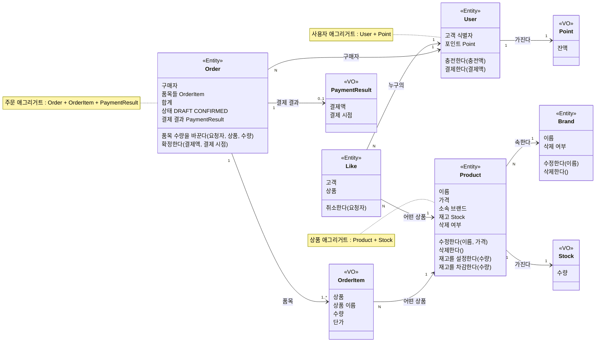

# commerce-api 도메인 관계

도메인 객체의 관계와, 재고·포인트를 지키는 책임이다. 근거는 [요구사항 문서](./requirements.md)의 요구사항 ID와 정책 ID를 가리킨다. 이 구조가 지키려는 목표와 계층은 [설계 문서](./commerce-api-design.md)의 아키텍처에 있다.

## 클래스 다이어그램

- `<<Entity>>`는 식별자로, `<<VO>>`는 값으로 같은지 판단한다.
- 화살표는 아는 방향이다. 애그리거트 밖에서는 루트만 가리킨다.
- User는 고객이다. 관리자는 요청자일 뿐 도메인 객체가 아니다.

## 관계

| 관계 | 누가 누구를 아는가 | 규칙 |
| --- | --- | --- |
| Brand 1 ── N Product | Product가 자신이 속한 Brand를 안다. Brand는 Product를 모른다. | REL-01 ~ REL-04 |
| User 1 ── N Like N ── 1 Product | Like가 User와 Product를 안다. Product는 Like를 모른다. | REL-05 ~ REL-08 |
| Order 1 ── 1..N OrderItem | Order가 자신의 OrderItem을 가진다. | REL-09 ~ REL-11 |
| OrderItem N ── 1 Product | OrderItem이 주문한 Product를 가리킨다. | REL-12 ~ REL-14 |
| User 1 ── N Order | Order가 구매자인 User를 안다. | REL-15 |
| Order 1 ── 0..1 PaymentResult | Order가 자신의 결제 결과를 가진다. | REL-16 |

### 관계에 걸린 규칙

규칙 ID는 `REL-순번` 형식이다. 새 규칙은 다음 순번을 받는다.

| ID | 관계 | 규칙 | 근거 |
| --- | --- | --- | --- |
| REL-01 | Brand–Product | 상품의 브랜드는 바뀌지 않는다. 바꾸려 하면 요청 전체를 거절한다. | R-ADMIN-07, P-ADMIN-04 |
| REL-02 | Brand–Product | 존재하며 삭제되지 않은 브랜드에만 상품을 만들 수 있다. | R-ADMIN-05 |
| REL-03 | Brand–Product | 삭제되지 않은 상품이 연결된 브랜드는 삭제할 수 없다. 재고가 0인 상품도 포함한다. | R-ADMIN-02, R-ADMIN-03 |
| REL-04 | Brand–Product | 브랜드를 삭제해도 상품의 브랜드 참조는 남는다. | R-ADMIN-14 |
| REL-05 | User–Like–Product | 한 고객은 한 상품에 좋아요를 하나만 가진다. | R-LIKE-02 |
| REL-06 | User–Like–Product | 삭제되지 않은 상품에만 좋아요를 등록할 수 있다. | R-LIKE-01, R-LIKE-07 |
| REL-07 | User–Like–Product | 상품의 좋아요 수는 Like를 세어 얻는다. | R-LIKE-05 |
| REL-08 | User–Like–Product | 상품이 삭제되어도 Like는 남고, 고객은 자신의 Like를 취소할 수 있다. | R-LIKE-08 |
| REL-09 | Order–OrderItem | 품목은 하나 이상이다. | R-ORDER-01, P-ORDER-01 |
| REL-10 | Order–OrderItem | 한 주문에 상품마다 품목이 하나다. 같은 상품은 수량을 합산한다. | R-ORDER-15, P-ORDER-02 |
| REL-11 | Order–OrderItem | 합계는 품목 금액의 합이다. | R-ORDER-02 |
| REL-12 | OrderItem–Product | 존재하며 삭제되지 않은 상품만 품목이 될 수 있다. | R-ORDER-05 |
| REL-13 | OrderItem–Product | 품목은 주문을 생성할 때의 상품 이름과 단가를 기록한다. | R-ORDER-02, P-ORDER-03, P-ORDER-07 |
| REL-14 | OrderItem–Product | 상품이 바뀌거나 삭제되어도 품목은 그대로다. | R-ADMIN-14, P-ORDER-07 |
| REL-15 | User–Order | 고객은 자신의 주문만 다룬다. | R-ACCESS-03, R-ORDER-13 |
| REL-16 | Order–PaymentResult | 확정된 주문만 결제 결과를 가진다. | R-ORDER-12 |

Like는 고객과 상품 사이에 따로 존재하는 관계라서 Entity로 둔다. 고객 쪽(내 좋아요 목록)과 상품 쪽(좋아요 수)에서 모두 묻고, 상품이 삭제되어도 남는다. (R-LIKE-03, R-LIKE-05, R-LIKE-08)

## 애그리거트와 불변식

밖에서는 루트에만 요청하고, 묶인 값은 루트를 통해서만 바뀐다. 그래서 루트가 묶음 안의 불변식을 지킨다.

| 애그리거트 | 루트 | 묶인 값 | 루트가 지키는 불변식 | 근거 |
| --- | --- | --- | --- | --- |
| 상품 | Product | Stock | 이름과 가격이 유효 범위 안에 있다. · 재고는 0 이상이다. · 삭제된 상품은 수정하거나 재고를 바꿀 수 없다. | R-ADMIN-06, R-ADMIN-08, R-ADMIN-13, P-ADMIN-02, P-ADMIN-03 |
| 주문 | Order | OrderItem, PaymentResult | 품목은 하나 이상이고 상품마다 하나다. · 수량은 양수다. · 합계는 품목 금액의 합이다. · `DRAFT` 주문만 품목 수량을 바꾸고 확정한다. · `CONFIRMED` 주문에는 결제 결과가 있다. | R-ORDER-02, R-ORDER-03, R-ORDER-06, R-ORDER-12, R-ORDER-15, P-ORDER-01, P-ORDER-02, P-ORDER-04, P-ORDER-05, P-ORDER-06 |
| 사용자 | User | Point | 잔액은 0 이상이고 표현할 수 있는 범위를 넘지 않는다. | R-POINT-05, R-POINT-07 |
| 브랜드 | Brand | — | 이름이 유효하다. · 삭제된 브랜드는 수정할 수 없다. | R-ADMIN-13, R-ADMIN-15, P-ADMIN-01 |
| 좋아요 | Like | — | 본인의 좋아요만 취소한다. | R-LIKE-04 |

한 애그리거트가 혼자 지킬 수 없는 불변식은 여러 애그리거트를 함께 보는 도메인 서비스가 지킨다. 도메인 서비스는 여러 애그리거트에 걸친 업무를 판단하고 수행하며, 각 상태는 그 상태를 가진 루트가 바꾼다.

| 불변식 | 지키는 곳 | 근거 |
| --- | --- | --- |
| 삭제되지 않은 상품이 연결된 브랜드는 삭제되지 않는다. 재고가 0인 상품도 포함한다. | 도메인 서비스 (브랜드 삭제 가능 여부) | R-ADMIN-02, R-ADMIN-03 |
| 한 고객은 한 상품에 좋아요를 하나만 가진다. | 도메인 서비스 (좋아요 중복 여부) | R-LIKE-02 |
| 삭제되지 않은 브랜드끼리는 이름이 다르다. | 도메인 서비스 (브랜드 이름 중복 여부) | P-ADMIN-01 |
| 같은 브랜드의 삭제되지 않은 상품끼리는 이름이 다르다. | 도메인 서비스 (상품 이름 중복 여부) | P-ADMIN-02 |
| 확정된 주문은 재고와 포인트 차감이 함께 반영된 주문이다. | 도메인 서비스 (주문 확정) | R-ORDER-10, R-ORDER-11, R-ORDER-12 |

## 재고와 포인트의 책임

재고와 포인트는 따로 추적할 요구가 없어서, 각각 Product와 User가 가진 값(VO)으로 둔다. 값이 바뀌면 새 값으로 교체된다.

| | 재고 | 포인트 |
| --- | --- | --- |
| 무엇인가 | Product가 가진 재고 수량 | User가 가진 포인트 잔액 |
| 지키는 불변식 | 수량은 0 이상이다. | 잔액은 0 이상이고, 표현할 수 있는 범위를 넘지 않는다. |
| 바뀌는 입구 | Product의 재고 설정(관리자)과 재고 차감(주문 확정) | User의 충전(고객)과 결제(주문 확정) |
| 행동의 조건 | 삭제된 상품의 재고는 바꿀 수 없다. · 차감할 수량은 현재 재고 이하여야 한다. | 충전액은 양의 정수여야 한다. · 결제액은 잔액 이하여야 한다. · 1포인트는 1원이다. · 거절되면 잔액을 유지한다. |
| 처음 값 | 상품을 만들면 0이다. | 충전한 적이 없으면 0이다. |
| 근거 | R-ADMIN-08, R-ADMIN-13, R-ORDER-08, R-ORDER-10, R-ORDER-11, P-ADMIN-05 | R-POINT-01, R-POINT-03, R-POINT-04, R-POINT-05, R-POINT-07, R-POINT-08, R-ORDER-09, R-ORDER-11, P-POINT-01 |

- 호출하는 쪽은 수량이나 잔액을 꺼내 계산하지 않고, Product와 User에 차감과 결제를 요청한다. 그래서 재고와 잔액이 바뀌는 입구가 루트 하나뿐이다.
- 주문 확정은 재고와 포인트를 함께 바꾼다. 확정해도 되는지는 도메인 서비스(주문 확정)가 주문·상품·구매자를 함께 보고 판단하고, 모두 통과할 때만 각 루트에 차감·결제·확정을 요청한다. 유스케이스는 바뀐 것을 한 번에 저장한다.
