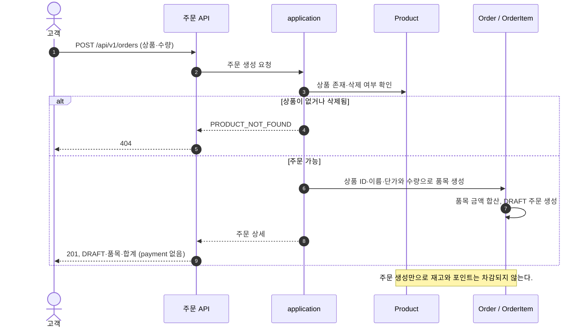
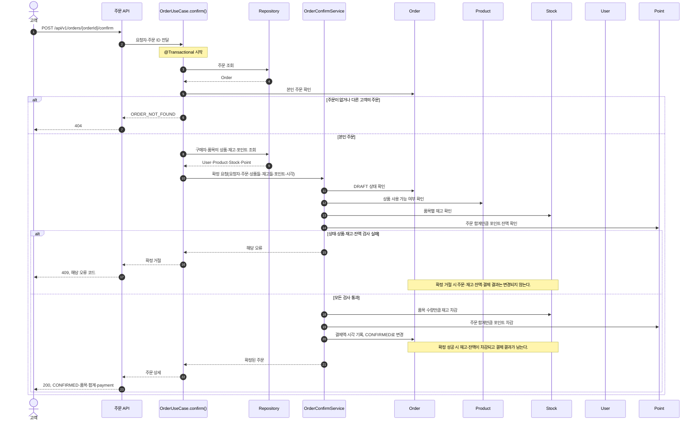

# 주문 생성·확정 시퀀스

> 변경일: 2026-10-07
>
> Point·Stock을 독립 저장 단위로 다루는 설계안으로 갱신했다. 기존 ADR과 `decisions.md`는 수정하지 않는다.

[요구사항](./requirements.md), [도메인 규칙](./domain-rules.yaml), [도메인 관계](./domain-relations.md), [API 계약](./api-contract.md)을 기준으로 주문의 상태 변화를 그린다. 아래의 검사는 업무상 판단 순서이며, DB 잠금·SQL 순서는 아직 정하지 않았다.

## 주문 생성

## 주문 확정

`DRAFT` 주문만 확정할 수 있다. 이미 `CONFIRMED`인 주문의 재확정은 `ORDER_ALREADY_CONFIRMED`로 거절한다.

`OrderUseCase.confirm()`이 트랜잭션 경계다. 정상 반환 시 commit된 뒤 HTTP 성공 응답을 보내고, 예외가 전달되면 rollback 후 오류를 응답한다. 확정 성공 시 재고·포인트·주문 상태·결제 결과는 함께 반영된다. 검사에서 거절되거나 처리 중 실패하면 이번 확정으로 바뀐 상태를 남기지 않는다. Product와 Stock, User와 Point는 별도 저장 단위이므로 확정 서비스가 네 애그리거트를 하나의 DB 트랜잭션으로 조정한다. 잠금 전략과 일관된 잠금 순서는 3주차 동시성 설계에서 결정한다.
